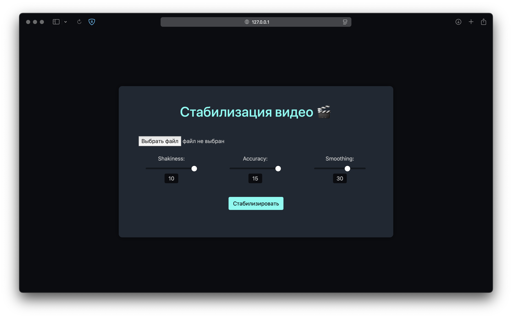
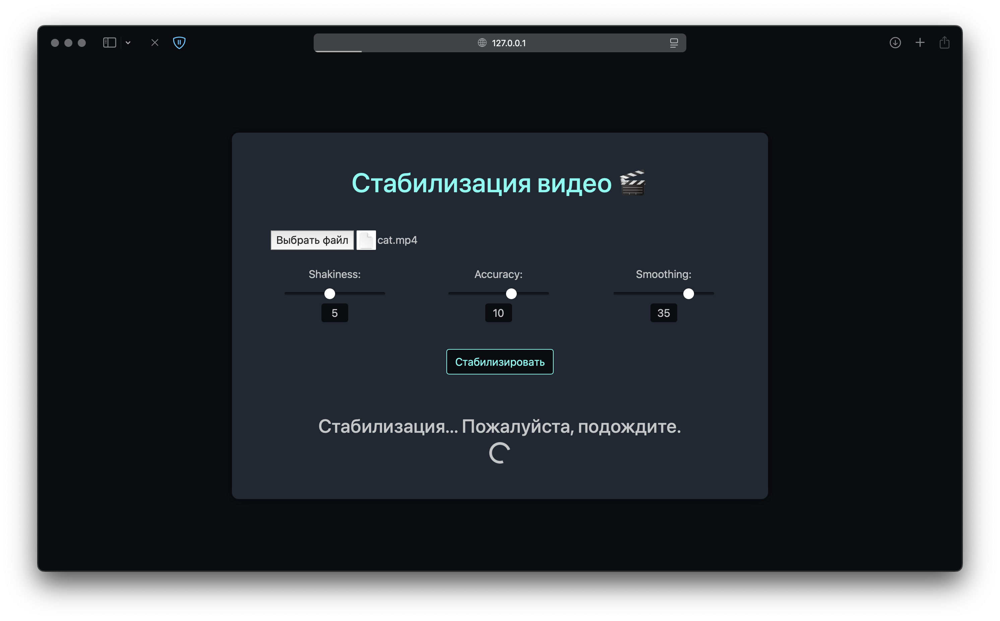
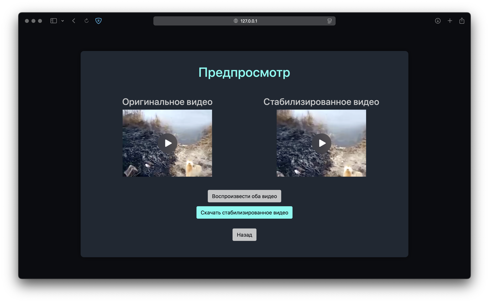

# Стабилизация видео

## Описание проекта

Приложение предназначено для стабилизации видеофайлов с использованием FFmpeg. Оно предоставляет веб-интерфейс, который позволяет пользователям загружать видеофайлы, настраивать параметры стабилизации и скачивать отстабилизированный видеофайл.

## Функционал

- Загрузка видеофайлов для стабилизации
- Настройка параметров стабилизации через веб-интерфейс
- Обработка видео с использованием FFmpeg
- Предварительный просмотр и скачивание обработанного видео

## Установка и запуск

### Запуск без Docker

1. **Клонируйте репозиторий:**

   ```bash
   git clone https://git.miem.hse.ru/emglinnik/cg_homework
   cd cg_homework
   ```

2. **Установите необходимые зависимости:**

   Выполните команду:

   ```bash
   pip3 install -r requirements.txt
   ```

   или
   
   ```bash
   pip install -r requirements.txt
   ```

3. **Установите ffmpeg:**

   Установите ffmpeg на свою систему. Например:

   ```bash
   brew install ffmpeg
   ```

   Также вы можете установить ffmpeg с официального [сайта](https://www.ffmpeg.org), но не забудьте добавить для него PATH.

3. **Запустите приложение:**

   ```bash
   python3 main.py
   ```
   
   или

   ```bash
   python main.py
   ```

4. **Откройте браузер и перейдите по адресу:**

   ```
   http://127.0.0.1:5500
   ```

### Запуск с использованием Docker

1. **Убедитесь, что у вас установлен Docker и Docker Compose.**

2. **Клонируйте репозиторий:**

   ```bash
   git clone https://git.miem.hse.ru/emglinnik/cg_homework
   cd cg_homework
   ```

3. **Соберите и запустите приложение с помощью Docker Compose:**

   ```bash
   docker-compose up --build
   ```

4. **Откройте браузер и перейдите по адресу:**

   ```
   http://127.0.0.1:5500
   ```

## Примечания

- Порт в веб-приложении настроен на 5500. Вы можете изменить его в файле `docker-compose.yml` и в коде приложения, если это необходимо.
- Для установки ffmpeg вы можете воспользоваться любым другим пакетным менеджером. В примере используется `Homebrew`.

## Использование
### 1. Главная страница
На главной странице вам доступны кнопки для выбора файла, ползунки для регулировки параметров стабилизации и кнопка Стабилизировать.


### 2. Стабилизация
Нажмите на поле `Выбрать файл` и загрузите видео. Отрегулируйте параметры под свои нужды и нажмите `Стабилизировать`. Дождитесь окончания процесса стабилизации.


### 3. Страница предпросмотра
Стабилизация завершена. Вы можете отдельно просмотреть оба файла или сравнить их, нажав на кнопку `Воспроизвести оба видео`, которая запустит оба ролика одновременно. Скачайте отстабилизированное видео нажав на соответствующую кнопку. Чтобы вернуться на главную страницу, нажмите `Назад`.
